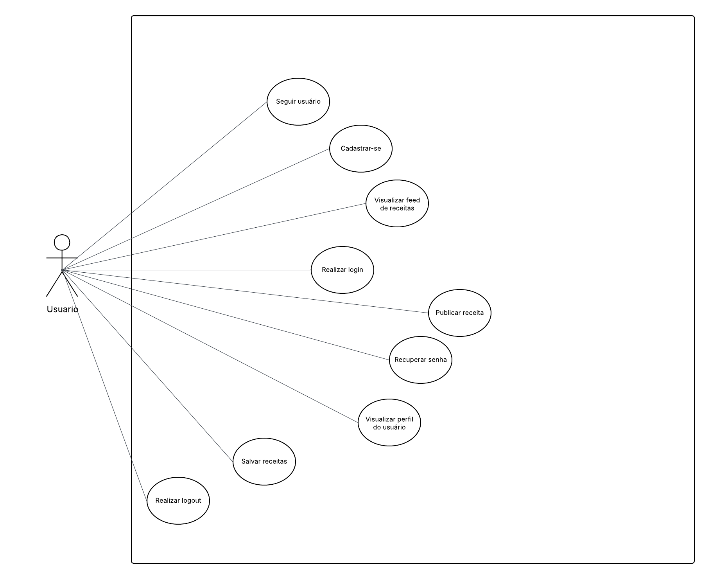
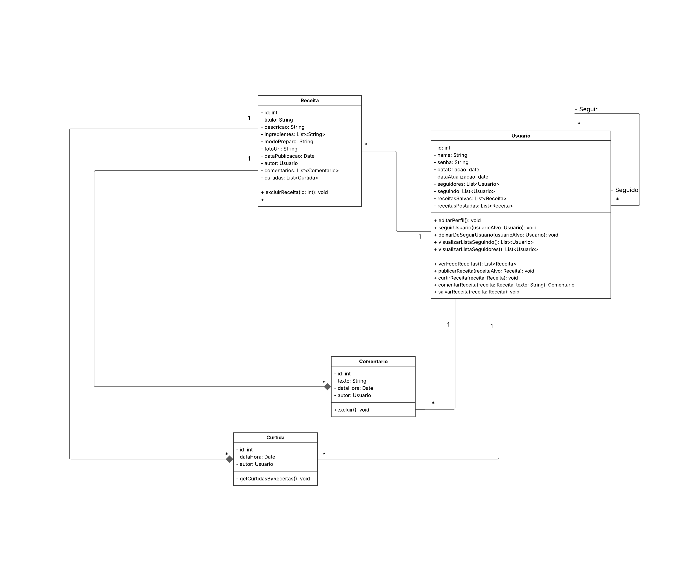
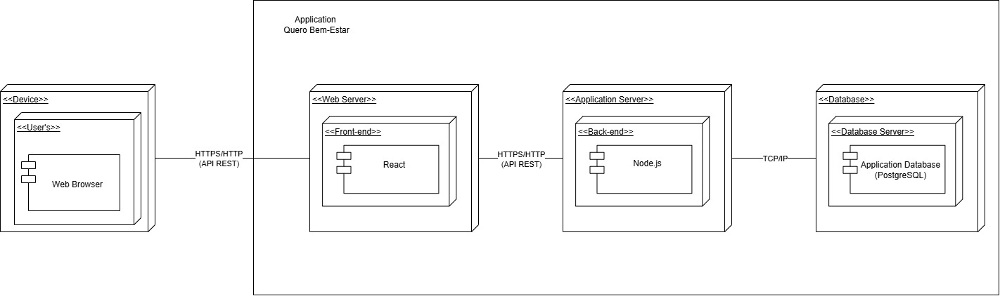

# 4.1. Documento de Arquitetura de Software (DAS)

## 4.1.1 Introdução

---

Este documento descreve a arquitetura do sistema Quero Bem Estar, que visa proporcionar aos usuários uma solução para os desafios de seguir uma alimentação saudável.

O projeto surge da iniciativa de incentivar as pessoas a se unirem e compartilharem sua jornada com um objetivo em com, se manter contante em um plano alimentar. Inicialmente tinha-se como planejado, uma releitura do aplicativo Gym-Rats, um aplicativo de competição entre amigos para motivar o exercício físico constante. Neste sentido, o QueroBemEstar surge adaptando a ideia de competição e socialização para a esfera da alimentação saudável.

Devido à imprevistos no cronograma, necessitou-se uma redução do escopo inicial.

Este documento detalha a representação arquitetural do sistema, seus principais componentes e suas responsabilidades, além de apresentar as tecnologias empregadas, as decisões de projeto, as restrições existentes e os critérios de qualidade que nortearam o desenvolvimento.

## 4.1.2 Representação arquitetural

**Dispositivo de Acesso**
O acesso ao sistema é realizado por meio de um navegador web (Web Browser) rodando no dispositivo do usuário.
O navegador é o ponto de entrada da aplicação, responsável por fazer as requisições iniciais e renderizar a interface do usuário.

**Web Server (Front-end)**
A primeira camada de servidores é o Web Server, que hospeda a aplicação de front-end desenvolvida em React.
Este componente recebe as requisições via HTTPS/HTTP (API REST) do navegador do usuário.

**Application Server (Back-end)**
A camada de lógica de negócios é gerenciada pelo Application Server, que hospeda o back-end da aplicação.
Ele será desenvolvido com Node.js e é responsável por processar as requisições recebidas do front-end, também via HTTPS/HTTP (API REST), e interagir com o banco de dados.

**Database Server**
O Database Server é o servidor de banco de dados, que hospeda a base da aplicação, utilizando o PostgreSQL.
A comunicação entre o Application Server e o banco de dados ocorre via TCP/IP, um protocolo de comunicação seguro e confiável, ideal para ambientes internos.

## 4.1.3 Metas e restrições arquiteturais

### Metas
**Usabilidade:** RNF01: O design da interface deve ser centrada no usuário com protótipos testados, de forma que novos usuários consigam realizar ações básicas (ex.: cadastro, criação de grupo) em até 2 minutos.
RNF02: O sistema deve ser responsivo, funcionando corretamente em navegadores desktop e dispositivos móveis (Android e iOS). Utilizando um design responsivo.

**Desempenho:** RNF03: O carregamento de feeds e imagens deve ocorrer em no máximo 3 segundos em conexões de 10 Mbps. Otimizando recursos front-end com compressão, llazy loading, implementar cache, monitorar tempos de resposta e realizar testes de desempenho em condições reais de rede.

**Segurança:** RNF04: Dados de autenticação devem ser armazenados de forma segura, utilizando algoritmos de hash seguros para senhas, criptografia para dados sensíveis, HTTPS para comunicação segura, autenticação robusta e realizar auditorias e testes regulares de segurança.

**Escalabilidade:** RNF05: O sistema deve suportar pelo menos 100 usuários ativos simultaneamente sem degradação significativa do desempenho. Utilizando bancos de dados eficientes.

### Restrições

**Prazo Definido:** Por se tratar de uma disciplina de faculdade, as entregas se limitam ao semestre 2025.2. Limitando o escopo da solução.

**Conhecimento técnico da equipe:** Limitações técnicas da equipe podem afetar decisões, resultados e cumprimento do prazo.

**Recursos humanos:** A disponibilidade de cada membro da equipe é bastante individual, e isso pode afetar a comunicação e o desenvolvimento das entregas.

## 4.1.4 Visualização de casos de uso

Realização do caso de uso: publicar receitas no feed, para compartilhar minhas ideias culinárias.

Realização do caso de uso: comentar nas refeições, para interagir e dar feedback.

---

---

## 4.1.5 Visualização Lógica

A arquitetura lógica do QueroBemEstar é organizada em uma estrutura multicamadas, com o objetivo de separar responsabilidades, reduzir acoplamento e facilitar a evolução do sistema. De forma geral, o sistema é dividido em:

**Camada de Apresentação (Frontend)**
Responsável pela interface com o usuário, fornecendo telas web responsivas para cadastro, login, visualização de receitas.

**Camada de Aplicação (Serviços / Regras de Negócio)**
Orquestra os casos de uso do sistema (ex.: criar publicação, comentar, gerar convite). Essa camada coordena a interação entre as entidades de domínio e os componentes de infraestrutura, garantindo que as regras de negócio sejam corretamente aplicadas.

**Camada de Domínio**
Contém os modelos centrais do negócio, como Usuário, Receita, Convite, Notificação. Essa camada encapsula as regras de negócio mais estáveis, independentes de tecnologia.

**Camada de Infraestrutura (Persistência e Integrações)**
Implementa o acesso a dados (repositórios), persistência em banco de dados e integrações externas necessárias. A camada de aplicação consome essa camada por meio de interfaces, mantendo baixo acoplamento.

Essa organização lógica permite que mudanças na interface (por exemplo, inclusão de um app mobile) ou na tecnologia de persistência tenham impacto mínimo nas regras de negócio.

### Pacotes e Subsistemas Arquiteturalmente Significativos

O Diagrama de Pacotes representa a organização modular do sistema, mostrando como as funcionalidades são agrupadas e como os pacotes se relacionam. A seguir, são descritos os principais pacotes identificados.

#### Pacote `Usuarios`

Responsável pelas operações relacionadas ao gerenciamento de usuários:

- criação e edição de perfil;  
- seguir e deixar de seguir outros usuários;  
- visualização de seguidores, seguidos e receitas do usuário;  
- acesso às interações realizadas pelo usuário (comentários, curtidas, receitas salvas).

#### Pacote `Interacoes`

Engloba o engajamento social da plataforma:

- criação e exclusão de comentários;  
- registro e consulta de curtidas;  
- relacionamento das interações com usuários e receitas.

Esse pacote depende diretamente dos pacotes `Usuarios` e `Receitas`.

---

---

### Principais classes e relacionamentos

O Diagrama de Classes modela a estrutura estática do domínio do QueroBemEstar, destacando as principais entidades e seus relacionamentos.

#### Classe `Usuario`

Modela o usuário da plataforma.

**Atributos (exemplos):**  
`id`, `name`, `senha`, `dataCriacao`, listas de `seguidores`, `seguidos`, `receitasSalvas`, `receitasPostadas`.

**Responsabilidades principais:**

- gerenciar o próprio perfil (p.ex. `editarPerfil()`);  
- seguir e deixar de seguir outros usuários;  
- publicar receitas;  
- comentar, curtir e salvar receitas;  
- visualizar listas de seguidores, seguidos e receitas.

**Associações:**

- 1 `Usuario` → N `Receita` (receitas postadas);  
- 1 `Usuario` → N `Comentario`;  
- 1 `Usuario` → N `Curtida`;  
- autoassociação N–N representando a relação seguir/seguido.

#### 5.3.2 Classe `Receita`

Representa uma receita fitness compartilhada na plataforma.

**Atributos (exemplos):**  
`id`, `titulo`, `descricao`, `ingredientes`, `modoPreparo`, `fotoUrl`, `dataPublicacao`, `autor`.

**Responsabilidades principais:**

- armazenar informações da receita;  
- se necessário, disponibilizar operações como `excluirReceita(id)`.

**Associações:**

- 1 `Receita` → 1 `Usuario` (autor);  
- 1 `Receita` → N `Comentario`;  
- 1 `Receita` → N `Curtida`.

---

---

## 4.1.6 Visão de implantação

---

---

## Histórico de Versão
| Data       | Versão | Descrição                                                                                        | Autor                                                                                                                                                                                                                 | Revisores                                                                                                                                                              |
| ---------- | ------ | ------------------------------------------------------------------------------------------------ | --------------------------------------------------------------------------------------------------------------------------------------------------------------------------------------------------------------------- | ---------------------------------------------------------------------------------------------------------------------------------------------------------------------- |
| 20/11/2025 | `1.0`  | Criação do documento | [Filipe Bressanelli](https://github.com/fbressa)                                                                                                                                                                          |                                                                                                                                                                        |
| 20/11/2025 | `2.0`  | adiciona, visões do modelo DAS (Visão lógica e casos de Uso) | [Filipe Bressanelli](https://github.com/fbressa)                                                                                                                                                                          |                                                                                                                                                                        |
